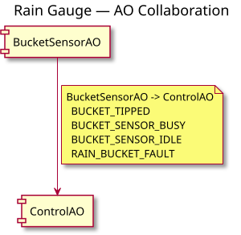

# collab

**A small textual modelling language for collaborations between Active Objects.**

`collab` lets a system designer describe which Active Objects collaborate and the signals that travel between them in a compact, human-readable `.collab` file.

That model is the source of truth. The `collabc` compiler validates it and generates:

- a PlantUML collaboration diagram; and
- a QP-compatible C++ signal enumeration.

```text
                    .collab
              authoritative model
                     |
          +----------+-----------+
          |          |           |
          v          v           v
       validate   PlantUML   C++ signals
                    |           |
                    v           v
                SVG / PNG     QP / QM
```

The central idea is:

> **State machines describe behaviour within an object. Signals describe contracts between objects.**

`collab` models the latter. Tools such as QM can remain responsible for the internal hierarchical state machine of each Active Object.

## A `.collab` model

Here is the complete Rain Gauge example:

```text
collab 1
title "Rain Gauge — AO Collaboration"

# Active Objects
ao BucketSensorAO
ao ControlAO

# BucketSensorAO recognises valid bucket behaviour and reports semantic
# results and local readiness to the system coordinator.
collaboration BucketSensorAO ControlAO
  BucketSensorAO -> ControlAO
    BUCKET_TIPPED
    BUCKET_SENSOR_BUSY
    BUCKET_SENSOR_IDLE
    RAIN_BUCKET_FAULT
end
```

The model says that:

- `BucketSensorAO` and `ControlAO` exist;
- they have one collaboration;
- four signals travel from `BucketSensorAO` to `ControlAO`; and
- no signals currently travel in the opposite direction.

A collaboration is declared once for a pair of AOs. Signals travelling in the same direction are grouped together. If signals are declared in both directions, `collab` derives a bidirectional collaboration automatically.

See [`examples/rain-gauge.collab`](examples/rain-gauge.collab) for the source example.

## What it generates

Running `collabc` over the example produces two primary artefacts.

### PlantUML

The generated PlantUML contains one relationship for the collaboration and derives its arrowhead from the declared signal direction:

```plantuml
component "BucketSensorAO" as BucketSensorAO
component "ControlAO" as ControlAO

BucketSensorAO --> ControlAO
note on link
  BucketSensorAO -> ControlAO
    BUCKET_TIPPED
    BUCKET_SENSOR_BUSY
    BUCKET_SENSOR_IDLE
    RAIN_BUCKET_FAULT
end note
```

The generated source is in [`examples/rain-gauge.puml`](examples/rain-gauge.puml).

Rendered with PlantUML, it produces the collaboration diagram:



### C++ signal catalogue

The same `.collab` source generates a QP-compatible signal enum:

```cpp
#pragma once

#include "qpcpp.hpp"

enum AppSignals {
    BUCKET_TIPPED_SIG = QP::Q_USER_SIG,  // BucketSensorAO -> ControlAO
    BUCKET_SENSOR_BUSY_SIG,              // BucketSensorAO -> ControlAO
    BUCKET_SENSOR_IDLE_SIG,              // BucketSensorAO -> ControlAO
    RAIN_BUCKET_FAULT_SIG,               // BucketSensorAO -> ControlAO

    MAX_APP_SIG
};
```

See [`examples/rain-gauge-signals.hpp`](examples/rain-gauge-signals.hpp).

The generated `.puml` and `.hpp` files are derived artefacts. Edit the `.collab` model and regenerate them rather than maintaining the generated files independently.

## Running `collab`

`collabc` is currently a Python script and has no external Python package dependencies.

From the repository root, validate the example without generating files:

```bash
python3 src/collabc.py examples/rain-gauge.collab --check
```

Generate both the PlantUML and C++ signal header:

```bash
python3 src/collabc.py examples/rain-gauge.collab
```

Expected output is similar to:

```text
OK: 2 AO(s), 1 collaboration(s), 4 signal(s)
generated: examples/rain-gauge.puml
generated: examples/rain-gauge-signals.hpp
```

To treat house-convention warnings as errors:

```bash
python3 src/collabc.py examples/rain-gauge.collab --check --strict
```

To render the generated PlantUML as SVG:

```bash
plantuml -tsvg examples/rain-gauge.puml
```

PlantUML is only required for rendering the generated diagram; it is not required to parse or validate a `.collab` model or to generate the `.puml` and C++ files.

Run:

```bash
python3 src/collabc.py --help
```

for the complete compiler command line.

## Design principles

The initial language is intentionally small.

A few principles guide it:

- **One collaboration per AO pair.** Ten signals between two AOs are still one collaboration.
- **Signals are grouped by direction.** The collaboration describes a communication relationship rather than a bundle of unrelated drawing arrows.
- **Direction has one source of truth.** Diagram arrowheads are derived from the directional signal declarations.
- **The model is human-readable.** A `.collab` file should remain useful as an architectural document.
- **The compiler validates conventions.** It checks structural consistency and can report departures from selected house rules.
- **Generated artefacts are disposable.** The `.collab` source remains authoritative.
- **The language grows from demonstrated need.** Version 1 deliberately avoids event payloads, deployment, HSM states, timers, priorities and other concerns until real applications require them.

The detailed language syntax and current validation rules are documented in [`docs/HOWTO-collab-language.md`](docs/HOWTO-collab-language.md).

## Why does `collab` exist?

`collab` grew out of the design of an embedded Rain Gauge / Weather Station using Active Objects, QP and QM.

QM already provided an excellent executable model of the behaviour **within** each Active Object. The missing architectural model was the collaboration **between** Active Objects: who communicates with whom, in which direction, and using which domain signals.

An early attempt used PlantUML directly. That exposed an important distinction: PlantUML is a rendering language, while the collaboration information has semantics of its own. Once signal direction was also being used to derive C++ communication artefacts and enforce modelling conventions, the collaboration deserved a small language of its own.

That decision, its alternatives and its consequences are recorded in:

**[ADR-0001: Establish `collab` as a Textual Collaboration Modelling Language](docs/Decisions/ADR-0001-establish-collab-dsl.md)**

## Status

`collab` is at the beginning of its development.

The Rain Gauge is its first real application and is expected to drive the next language requirements. The current bias is deliberately toward a small language and a transparent compiler rather than speculative features.

## License

`collab` is released under the [MIT License](LICENSE).
